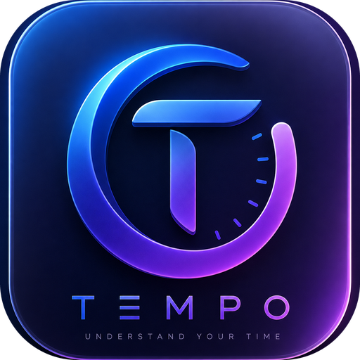
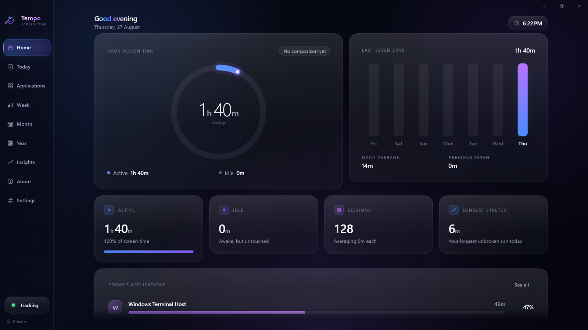
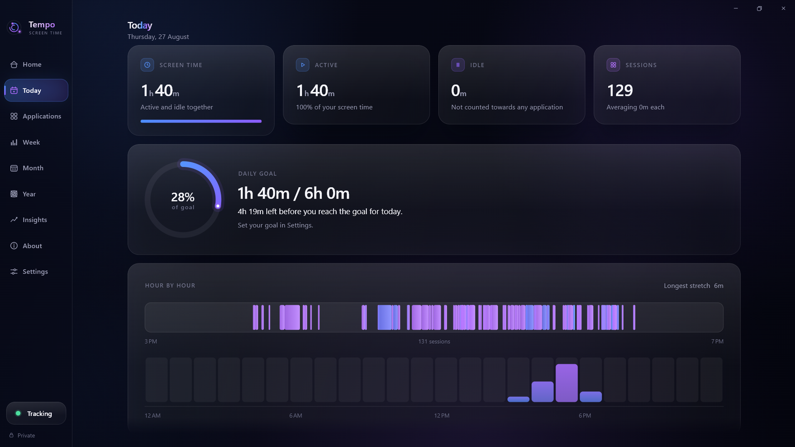
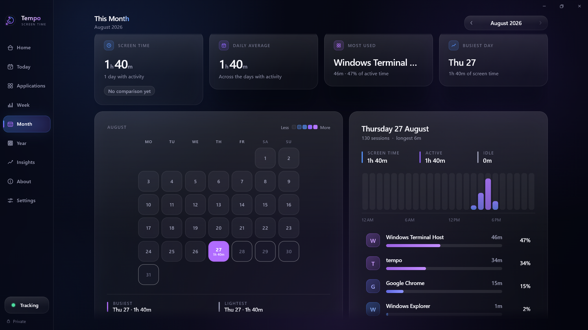

<div align="center">



# Tempo

**Screen time, measured beautifully.**

A private screen-time tracker for **Windows** and **macOS**. Tempo measures which
application is in front of you and for how long, then shows you your day, your
week, your month and your year — in one calm, midnight-blue interface.
Everything it records stays in a single file on your computer.


</div>



---

## Contents

1. [What Tempo is](#what-tempo-is)
2. [Screens](#screens)
3. [What it measures — and what it refuses to](#what-it-measures--and-what-it-refuses-to)
4. [Platform support](#platform-support)
5. [Install and run](#install-and-run)
6. [Build a release](#build-a-release)
7. [Keyboard](#keyboard)
8. [Where your data lives](#where-your-data-lives)
9. [Architecture](#architecture)
10. [How tracking works](#how-tracking-works)
11. [Sharing and exporting](#sharing-and-exporting)
12. [Troubleshooting](#troubleshooting)
13. [Project files](#project-files)
14. [Developer](#developer)

---

## What Tempo is

Most screen-time tools are either a phone feature you cannot reach from a
desktop, or a team dashboard that ships your day to somebody else's server.
Tempo is neither. It is a **desktop application that answers one question
honestly** — where did the hours go? — and keeps the answer to itself.

- **One measurement.** The foreground application and the time it holds,
  grouped by application rather than by window: ten Chrome windows are one
  Chrome.
- **Idle time counted separately.** Time the machine sits untouched is measured
  but belongs to no application, so a lunch break never turns into an hour of
  "work".
- **Sessions, not samples.** Stretches are stored as real sessions with a start
  and an end, so *longest unbroken run* and *number of sessions* mean something.
- **Every scale of the same day.** Today, the week, the month, the year, the
  applications behind them, and plain-language insights over any of it.
- **Quiet by default.** It measures from the tray, opens at login if you ask,
  and says something only when you pass the goal you set.
- **Nothing leaves the machine.** No account, no telemetry, no network request
  of its own.

---

## Screens

**Today** — the day against the goal you set, hour by hour, with every session
laid out on a single strip.



**Month** — a calendar that warms up on the days you worked, with any day's
detail beside it: its hours, its sessions and the applications that filled it.



Nine screens in all, one visual system:

| Screen | What it answers |
|---|---|
| **Home** | How is today going, and how does it compare to the last seven days? |
| **Today** | Where did today actually go — hour by hour, session by session? |
| **Applications** | What did I use, ranked, and what does one application look like over time? |
| **Week** | Seven days side by side, and the shape of each one. |
| **Month** | A calendar heatmap, with any day openable beside it. |
| **Year** | Every day of the year in one contribution-style grid. |
| **Insights** | Plain sentences about what actually changed, over a week, month or year. |
| **About** | Who built it, what it measures, and how to get the most out of it. |
| **Settings** | Goal, idle timeout, appearance, tray behaviour, export and deletion. |

---

## What it measures — and what it refuses to

**Measured**

- The identifier and display name of the frontmost application
  (`chrome.exe` → *Google Chrome*).
- How long it stayed in front, as a session with a start and an end.
- How long the machine went untouched, from the system's own idle timer.

**Never touched**

- No window titles, document names, URLs or file paths.
- No keystrokes, no screenshots, no clipboard, no camera or microphone.
- No account, no analytics, no crash reporting, no network request of any kind.

The first run explains all of this **before** a single second is recorded, and
nothing is measured until you answer it. Turning tracking off in Settings stops
the engine, not just the display.

> Tempo's numbers are Tempo's own measurement. Apple's Screen Time data is
> private to the system, and Tempo has no access to it.

---

## Platform support

| | Windows | macOS |
|---|---|---|
| **Version** | Windows 10 or 11 | macOS 10.15 or later |
| **Foreground app** | Win32 `GetForegroundWindow` → process → executable, with the executable's own file description as the name | `NSWorkspace.frontmostApplication` |
| **Idle time** | `GetLastInputInfo` | `CGEventSource.secondsSinceLastEventType` |
| **Permission prompt** | None — nothing here needs elevation | None — no Accessibility or Screen Recording, because no window contents are read |
| **Window chrome** | Tempo draws its own title bar and caption buttons | Native traffic lights, hidden title bar |
| **Tray / menu bar** | Tray icon with a live tooltip and menu | Menu-bar item with a template icon |
| **Start at login** | Run key, via the system's own mechanism | Login item |

Settings reports the real permission state as the platform gives it, rather
than assuming.

---

## Install and run

**Requirements**

- Flutter (stable) with desktop support enabled — developed against Flutter
  3.44, Dart SDK `^3.12.2`.
- **Windows:** Visual Studio 2022 with the *Desktop development with C++*
  workload.
- **macOS:** Xcode with command-line tools, and CocoaPods
  (`sudo gem install cocoapods`).

```bash
git clone https://github.com/<you>/tempo.git
cd tempo
flutter pub get

# make sure desktop support is on
flutter config --enable-windows-desktop   # Windows
flutter config --enable-macos-desktop     # macOS
flutter devices
```

```bash
flutter run -d windows
flutter run -d macos

flutter analyze          # the project's only verification step
```

Debug builds start with **preview data** on, so the interface can be judged
before any real history exists. A badge in the title bar says so, shared
reports are stamped, and a release build cannot turn it on at all.

> **Building on Windows?** Quit Tempo first — including from the tray, since
> closing the window leaves it measuring. A running `Tempo.exe` is locked, and
> the install step of the build will fail with `MSB3073`.

---

## Build a release

```bash
# Windows  → build\windows\x64\runner\Release\  (ship the whole folder)
flutter build windows --release

# macOS    → build/macos/Build/Products/Release/Tempo.app
flutter build macos --release
```

**Installers**

```bash
iscc packaging\windows\tempo.iss    # Windows installer (Inno Setup 6)
dart run msix:create                # MSIX for the Store or sideloading
./packaging/macos/build_release.sh  # macOS: build, sign, DMG, notarise, staple
```

The macOS script takes its identity from the environment
(`TEMPO_SIGN_IDENTITY`, `TEMPO_NOTARY_PROFILE`), so nothing secret lives in the
repository; without them it still produces an unsigned DMG. The MSIX identity
lives in `msix_config` in `pubspec.yaml` — set `publisher` to your certificate
subject before signing.

Before distributing: set your own `PRODUCT_BUNDLE_IDENTIFIER` in
`macos/Runner/Configs/AppInfo.xcconfig` (currently `com.tempo.desktop`), bump
`version:` in `pubspec.yaml`, and keep `AppInfo.version` in
`lib/core/constants/app_info.dart` in step — that is what the About screen
shows.

**Icons.** Every icon is generated from one master,
`assets/branding/app_icon_source.png`: the Windows `.ico` (nine sizes), the
tray icon (the mark alone, so it still reads at 16px), the macOS icon set, the
MSIX logo, and the 512px tile the first run shows. Regenerate them together if
the artwork changes.

---

## Keyboard

| Shortcut | Does |
|---|---|
| `Ctrl` + `1` … `9` | Jump straight to a section |
| `Ctrl` + `B` | Fold the sidebar into its icon rail |
| `Ctrl` + `,` | Open Settings |

On macOS, `Cmd` does the same as `Ctrl`.

---

## Where your data lives

One SQLite file in the platform's application-support folder — Settings shows
the exact path:

```
Windows   %APPDATA%\<company>\tempo\tempo.db
macOS     ~/Library/Application Support/<bundle id>/tempo.db
```

WAL journaling, so the engine's small, frequent writes never block the screens
reading alongside them.

| Table | Holds |
|---|---|
| `usage_sessions` | Every measured stretch: application id and name, start, end, duration, local day, platform. Indexed by day and by application. |
| `daily_summaries` | One row per day: active seconds, idle seconds, session count, longest session, per-hour minutes. |
| `application_summaries` | One row per application per day. |
| `settings` | Preferences, stored beside the history rather than in a second place. |

Summaries are always **rebuilt from the sessions of the day they belong to**,
so they can never drift from the record they came from. Days with nothing
stored come back as empty days rather than missing ones, which is why the
charts keep their rhythm across quiet stretches.

Settings can export everything as CSV or JSON, delete a range of days, or
delete the lot.

---

## Architecture

```
lib/
├── app/            application root, window setup
├── core/           design tokens: colour, type, spacing, radius, motion, layout
├── data/           SQLite database, DAOs, analytics repositories, providers
├── domain/         models and the tracking service — no Flutter imports
├── features/       one folder per screen (home, today, applications, week,
│                   month, year, insights, about, settings, onboarding, shell)
├── platform/       per-platform tracking, tray, notifications, start-at-login
└── shared/         the reusable widget library: glass surfaces, charts, stats
```

- **Flutter** with **Riverpod** for state; every screen reads providers rather
  than reaching for data itself.
- **One design system.** Colours, typography, spacing, radii, shadows, glass,
  buttons, cards, icons, charts and motion all live in `core/` and `shared/`,
  so no screen invents its own style. Both themes are built from the same
  tokens and lerp between them, which is why switching appearance crossfades
  the whole product instead of snapping.
- **Hand-drawn iconography and charts.** No icon font and no chart library:
  every glyph, ring, bar, heatmap and grid is a `CustomPainter`.
- **Motion with a purpose.** Entrances stagger, pages crossfade, the sidebar
  selection glides, numbers count, cards catch a slow diagonal sheen under the
  pointer — and every duration routes through one helper, so the system
  "reduce motion" setting makes the app still rather than fast.

---

## How tracking works

A single engine samples on a timer while the app is open:

1. Ask the platform for the frontmost application.
2. Ask the platform how long the machine has been untouched.
3. If the application changed, close the open session and start a new one.
4. If the idle timeout (default 5 minutes, configurable) has passed, close the
   open session and count the time as idle instead.
5. Write closed sessions down, then rebuild that day's summaries from its
   sessions.

Whatever is open is always written down before Tempo quits, so closing the app
— or the machine sleeping — never loses the stretch in progress.

---

## Sharing and exporting

- **Insights** can turn any span into a shareable card (image) or a plain-text
  report, and shows you exactly what it says before anything leaves the app.
  Application names can be left out.
- **Settings → Your data** exports the raw history as CSV or JSON.

Both are things you do deliberately. Tempo never sends anything by itself.

---

## Troubleshooting

**The window opens dark and empty.** Make sure you are running a build of the
current source; an old build can be left behind if a previous `flutter build`
failed at the install step (see the `MSB3073` note above).

**Nothing is being measured.** Check the tray pill on the sidebar: it says
*Tracking*, *Paused* or *Unavailable*, and Settings gives the reason. Tracking
stays off until the first run has been answered.

**The build fails with `MSB3073` / `INSTALL.vcxproj`.** Tempo is still running.
Quit it from the tray, or `Get-Process Tempo | Stop-Process -Force`.

**The window is bigger than the screen.** It shouldn't be — Tempo clamps its
opening size to the display it lands on. If a saved position leaves it awkward,
maximise once and it settles.

---

## Project files

| File | What it is |
|---|---|
| `DESIGN.md` | The design direction: style, palette, motion, screens, design system. |
| `RULES.md` | The working agreement this project was built under. |
| `PROGRESS.md` | A phase-by-phase record of what was built, and where each phase stopped. |

---

## Developer

**Rahoz Osman** — designed and built Tempo.
📧 [hozahoza2001@gmail.com](mailto:hozahoza2001@gmail.com)

The same information lives in the app, under **About**.

<div align="center">
<br />
<sub>Tempo measures your time, not you.</sub>
</div>
